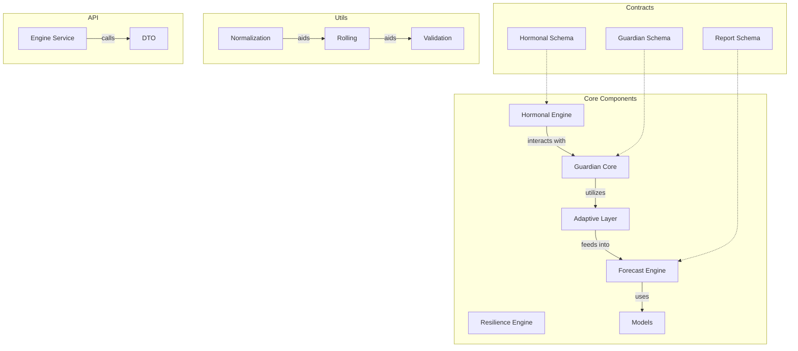

```mermaid
  graph TB
    subgraph Core Components
      HORM[Hormonal Engine]
      RESI[Resilience Engine]
      GUARD[Guardian Core]
      ADAP[Adaptive Layer]
      FORE[Forecast Engine]
      MODELS[Models]
    end
    
    subgraph Contracts
      H_SCHEMA[Hormonal Schema]
      G_SCHEMA[Guardian Schema]
      R_SCHEMA[Report Schema]
    end
    
    subgraph Utils
      ROLL[Rolling]
      NORM[Normalization]
      VALID[Validation]
    end
    
    subgraph API
      ENG_SRV[Engine Service]
      DTO[DTO]
    end
    
    HORM -->|interacts with| GUARD
    GUARD -->|utilizes| ADAP
    ADAP -->|feeds into| FORE
    FORE -->|uses| MODELS
    H_SCHEMA -.-> HORM
    G_SCHEMA -.-> GUARD
    R_SCHEMA -.-> FORE
    ROLL -->|aids| VALID
    NORM -->|aids| ROLL
    ENG_SRV -->|calls| DTO
```